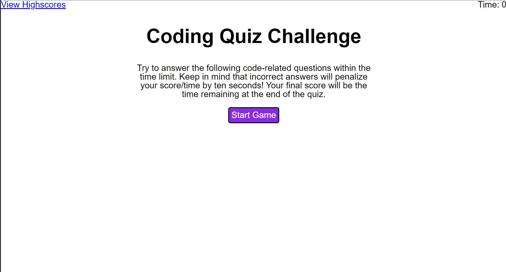

# Coding-Quiz

## Description

I have used Javascript to produce a quick quiz to check simple javascript concepts

## Installation

Not Required. 

## Usage

To click "Start Game" to begin. Answer the questions as fast as possible. A wrong answer results in a 10 second penalty. The game is over when the questions are finished or time runs out. You can save your score at the end which will be added to your highscores. Your time remaining is your score.
Access via: https://lhoole.github.io/Coding-Quiz//

## Credits
Html by USYD fullstack Bootcamp

## License

See LICENSE

